# Final Project Teknologi Komputasi Awan 2026
## Kelompok C02 — Order Processing Service

### Anggota Kelompok

| Nama | NRP |
|------|-----|
| Oryza Qiara Ramadhani | 5027241084 |
| Az Zahrra Tasya Adelia | 5027241087 |
| Naila Raniyah Hanan | 5027241078 |
| Nadia Kirana Afifah Prahandita | 5027241005 |
| Kaisar Hanif Pratama | 5027241029 |
| Gemilang Ananda Lingua | 5027241072 |
| Muhammad Huda Rabbani | 5027241098 |
| Angga Firmansyah | 5027241062 |

---

## 1. Introduction & Workflow Tim

Proyek ini merupakan implementasi **Order Processing Service** — layanan backend inti untuk platform e-commerce yang menangani pembuatan pesanan, pengecekan status, dan riwayat transaksi. Layanan ini di-deploy di atas infrastruktur cloud **Microsoft Azure** dengan arsitektur yang dirancang untuk menangani lonjakan traffic tinggi seperti flash sale dan promo.

Sesuai dengan *workflow* internal tim kami, pengerjaan dibagi menjadi 4 divisi utama agar berjalan paralel dan efisien:
1. **Divisi 1:** Melakukan *provisioning* 3 Virtual Machine di Azure beserta konfigurasi Network Security Group (NSG).
2. **Divisi 2:** Melakukan setup MongoDB, *deploy* Python Flask menggunakan Gunicorn, serta mengatur Nginx Reverse Proxy dan Nginx Load Balancer.
3. **Divisi 3:** Mengeksekusi pengujian kapasitas sistem (*Load Testing*) dalam 5 skenario secara bertahap menggunakan Locust.
4. **Divisi 4:** Mengonsolidasikan arsitektur, parameter penilaian, metrik *testing*, dan analisis *bottleneck* ke dalam dokumentasi pelaporan (*README*).

---

## 2. Arsitektur Cloud

### Diagram Arsitektur

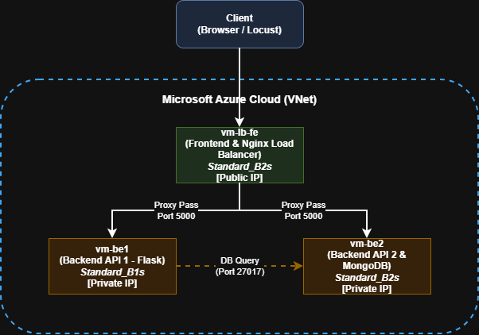

Arsitektur yang diimplementasikan menggunakan **3 VM** di Microsoft Azure dalam satu Virtual Network:

```
Internet (Client Browser / Locust)
                │
                ▼
    ┌───────────────────────────┐
    │        vm-lb-fe           │
    │  Public IP: 70.153.148.59 │
    │  Private IP: 10.0.0.4     │
    │  Nginx Load Balancer      │
    │  + Frontend (HTML/CSS)    │
    └────────────┬──────────────┘
                 │ Round-Robin (port 80)
         ┌───────┴────────┐
         ▼                ▼
┌─────────────────┐  ┌─────────────────┐
│    vm-be1       │  │    vm-be2       │
│  10.0.0.5       │  │  10.0.0.6       │
│  Flask (port 5000) │  │  Flask (port 5000) │
│  Gunicorn       │  │  Gunicorn       │
│  Nginx (port 80)│  │  Nginx (port 80)│
│  MongoDB ◄──────┼──┘  (port 27017)  │
│  (port 27017)   │                   │
└─────────────────┘  └─────────────────┘ 
```

**Catatan Desain:**
- MongoDB di-install di vm-be1 (bukan VM terpisah) sebagai pertimbangan efisiensi budget.
- vm-be2 mengakses MongoDB di vm-be1 melalui private IP 10.0.0.5:27017 dalam jaringan internal (latensi <1ms).
- Frontend di-serve langsung dari vm-lb-fe oleh Nginx, sedangkan request API akan di-proxy oleh Nginx LB ke upstream backend pool (BE1 + BE2).

### Spesifikasi VM & Estimasi Biaya

| Komponen | Spesifikasi | vCPU | RAM | Storage | Harga/Bulan |
|----------|----------|------|-----|---------|-------------|
| VM Backend 1 | B2s | 2 | 4 GB | 30 GB | $30 |
| VM Backend 2 | B2s | 2 | 4 GB | 30 GB | $30 |
| VM Frontend & Load Balancer| B2s | 2 | 1 GB | 30 GB | ~$12 |
| **Total** | | | | | **$72/bulan ✅** |

### Justifikasi Pemilihan Konfigurasi

- Kenapa `vm-be1` & `vm-be2` menggunakan 2 vCPU & 4 GB RAM: Hal ini untuk mendistribusikan beban komputasi API dan Gunicorn secara merata (high availability). Khusus pada vm-be1 yang juga menanggung proses I/O database MongoDB, kapasitas RAM 4 GB menjadi sangat krusial agar tidak terjadi bottleneck memory saat traffic tinggi.
- Kenapa `vm-lb-fe` menggunakan 2 vCPU & 1 GB RAM: VM ini hanya bertugas menjalankan Nginx (sebagai Reverse Proxy / Load Balancer) dan melayani file statis Frontend. Proses routing traffic ini sangat ringan pada RAM namun membutuhkan CPU yang responsif untuk menangani banyak koneksi TCP, sehingga konfigurasi 2/1 adalah yang paling hemat biaya (cost-effective).

## 3. Implementasi

### 3.1 Informasi VM

| VM | Public IP | Private IP |
|----|-----------|------------|
| vm-lb-fe | 70.153.148.59 | 10.0.0.4 |
| vm-be1 | 70.153.149.199 | 10.0.0.5 |
| vm-be2 | 48.193.47.130 | 10.0.0.6 |

SSH credentials:
```
User     : azureuser
Password : TkaFP2026!Azure
```

### 3.2 Setup MongoDB (vm-be1)

SSH ke vm-be1:
```bash
ssh azureuser@70.153.149.199
```

Install MongoDB 7.x:
```bash
curl -fsSL https://www.mongodb.org/static/pgp/server-7.0.asc | \
  sudo gpg -o /usr/share/keyrings/mongodb-server-7.0.gpg --dearmor

echo "deb [ arch=amd64,arm64 signed-by=/usr/share/keyrings/mongodb-server-7.0.gpg ] \
  https://repo.mongodb.org/apt/ubuntu jammy/mongodb-org/7.0 multiverse" | \
  sudo tee /etc/apt/sources.list.d/mongodb-org-7.0.list

sudo apt update && sudo apt install -y mongodb-org
```

Konfigurasi `bindIp` agar MongoDB bisa diakses dari vm-be2:
```bash
sudo nano /etc/mongod.conf
# Ubah baris bindIp:
# bindIp: 127.0.0.1 → bindIp: 127.0.0.1,10.0.0.5
```

Start & enable MongoDB:
```bash
sudo systemctl enable mongod && sudo systemctl start mongod
sudo systemctl status mongod
```

Buat index untuk optimasi query:
```bash
mongosh orders_db --eval "
db.orders.insertOne({temp: true});
db.orders.createIndex({ created_at: -1 });
db.orders.createIndex({ order_id: 1 }, { unique: true });
db.orders.deleteOne({temp: true});
printjson(db.orders.getIndexes());
"
```

Output konfirmasi index:
```json
[
  { "key": { "_id": 1 }, "name": "_id_" },
  { "key": { "created_at": -1 }, "name": "created_at_-1" },
  { "key": { "order_id": 1 }, "name": "order_id_1", "unique": true }
]
```

### 3.3 Deploy Flask + Gunicorn (vm-be1 & vm-be2)

Langkah berikut dilakukan di **kedua VM** (vm-be1 dan vm-be2).

SSH ke vm-be1:
```bash
ssh azureuser@70.153.149.199
```

Setup Python virtual environment & install dependencies:
```bash
python3 -m venv ~/venv
~/venv/bin/pip install flask pymongo gunicorn
```

Deploy `app.py`:
```bash
# Upload dari laptop lokal ke vm-be1
scp Resources/BE/app.py azureuser@70.153.149.199:~/app.py

# Copy dari vm-be1 ke vm-be2 via internal network
scp azureuser@10.0.0.5:~/app.py ~/app.py
```

Konfigurasi `MONGO_HOST` di masing-masing VM:
```bash
# Di vm-be1: MongoDB lokal
grep MONGO_HOST ~/app.py
# MONGO_HOST = os.environ.get("MONGO_HOST", "127.0.0.1")

# Di vm-be2: MongoDB di vm-be1 via private IP
sed -i 's/MONGO_HOST", "127.0.0.1"/MONGO_HOST", "10.0.0.5"/' ~/app.py
grep MONGO_HOST ~/app.py
# MONGO_HOST = os.environ.get("MONGO_HOST", "10.0.0.5")
```

Setup systemd service untuk Gunicorn (kedua VM):
```bash
sudo nano /etc/systemd/system/order-api.service
```

```ini
[Unit]
Description=Gunicorn instance to serve Order API
After=network.target

[Service]
User=azureuser
WorkingDirectory=/home/azureuser
ExecStart=/home/azureuser/venv/bin/gunicorn --workers 3 --bind 0.0.0.0:5000 app:app
Restart=always

[Install]
WantedBy=multi-user.target
```

```bash
sudo systemctl daemon-reload
sudo systemctl enable order-api
sudo systemctl start order-api

# Verifikasi
sudo systemctl status order-api
curl http://localhost:5000/orders
```

### 3.4 Setup Nginx Reverse Proxy (vm-be1 & vm-be2)

Install Nginx:
```bash
sudo apt update && sudo apt install -y nginx
```

Konfigurasi Nginx:
```bash
sudo nano /etc/nginx/sites-available/order-api
```

```nginx
server {
    listen 80;
    server_name _;

    location /order {
        proxy_pass http://127.0.0.1:5000;
        proxy_set_header Host $host;
        proxy_set_header X-Real-IP $remote_addr;
        proxy_set_header X-Forwarded-For $proxy_add_x_forwarded_for;
    }

    location /orders {
        proxy_pass http://127.0.0.1:5000;
        proxy_set_header Host $host;
        proxy_set_header X-Real-IP $remote_addr;
        proxy_set_header X-Forwarded-For $proxy_add_x_forwarded_for;
    }

    location /health {
        proxy_pass http://127.0.0.1:5000;
        proxy_set_header Host $host;
    }

    location / {
        root /var/www/html;
        index index.html;
        try_files $uri $uri/ /index.html;
    }
}
```

```bash
sudo ln -sf /etc/nginx/sites-available/order-api /etc/nginx/sites-enabled/order-api
sudo rm -f /etc/nginx/sites-enabled/default
sudo nginx -t && sudo systemctl enable nginx && sudo systemctl start nginx

# Verifikasi via Nginx
curl http://localhost/orders
```

### 3.5 OS-Level Tuning (vm-be1 & vm-be2)

```bash
# Tambah ke /etc/sysctl.conf
sudo bash -c 'echo "net.core.somaxconn = 65535" >> /etc/sysctl.conf'
sudo bash -c 'echo "net.ipv4.tcp_max_syn_backlog = 65535" >> /etc/sysctl.conf'
sudo sysctl -p

# Tambah ke /etc/security/limits.conf
sudo bash -c 'echo "azureuser soft nofile 65535" >> /etc/security/limits.conf'
sudo bash -c 'echo "azureuser hard nofile 65535" >> /etc/security/limits.conf'
```

Konfirmasi tuning aktif:
```bash
ulimit -n                          # → 65535
sysctl net.core.somaxconn          # → 65535
sysctl net.ipv4.tcp_max_syn_backlog # → 65535
```

### 3.6 Setup Nginx Load Balancer + Frontend (vm-lb-fe)

SSH ke vm-lb-fe:
```bash
ssh azureuser@70.153.148.59
```

Install Nginx:
```bash
sudo apt update && sudo apt install -y nginx
```

Konfigurasi Nginx sebagai Load Balancer:
```bash
sudo nano /etc/nginx/sites-available/lb
```

```nginx
upstream backend {
    server 10.0.0.5:80;
    server 10.0.0.6:80;
}

server {
    listen 80;
    server_name _;

    # Proxy API ke backend pool dengan strip prefix /api/
    location /api/ {
        rewrite ^/api(/.*)$ $1 break;
        proxy_pass http://backend;
        proxy_set_header Host $host;
        proxy_set_header X-Real-IP $remote_addr;
        proxy_set_header X-Forwarded-For $proxy_add_x_forwarded_for;
    }

    location /order {
        proxy_pass http://backend;
        proxy_set_header Host $host;
        proxy_set_header X-Real-IP $remote_addr;
    }

    location /orders {
        proxy_pass http://backend;
        proxy_set_header Host $host;
        proxy_set_header X-Real-IP $remote_addr;
    }

    location /health {
        proxy_pass http://backend;
        proxy_set_header Host $host;
    }

    # Serve frontend dari lokal (tidak di-forward ke backend)
    location / {
        root /var/www/html;
        index index.html;
        try_files $uri $uri/ /index.html;
    }
}
```

```bash
sudo ln -sf /etc/nginx/sites-available/lb /etc/nginx/sites-enabled/lb
sudo rm -f /etc/nginx/sites-enabled/default
sudo nginx -t && sudo systemctl enable nginx && sudo systemctl start nginx
```

Deploy frontend:
```bash
sudo mkdir -p /var/www/html
sudo cp ~/index.html ~/styles.css /var/www/html/
sudo chmod 644 /var/www/html/*
sudo chown -R www-data:www-data /var/www/html/
sudo systemctl reload nginx
```

Verifikasi end-to-end:
```bash
curl http://localhost/orders          # → []
curl http://localhost/health          # → {"status":"ok","db":"connected"}
curl http://70.153.148.59/orders     # → [] (via public IP)
```

---

## 4. Hasil Pengujian Endpoint

Pengujian dilakukan menggunakan **Postman** dengan target `http://70.153.148.59` (Load Balancer public IP).

### 4.1 POST /order — Create Order (201 Created)

Request Body:
```json
{
  "product": "Sepatu Running",
  "quantity": 2,
  "price": 150000
}
```

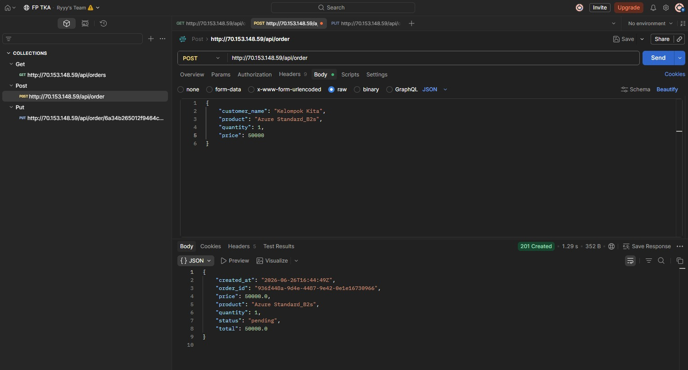

Response (201 Created):
```json
{
  "order_id": "0e1f0533-5b81-4221-9231-101969c31e4e",
  "product": "Sepatu Running",
  "quantity": 2,
  "price": 150000.0,
  "total": 300000.0,
  "status": "pending",
  "created_at": "2026-06-20T04:06:43Z"
}
```

### 4.2 GET /orders — Get All Orders (200 OK)

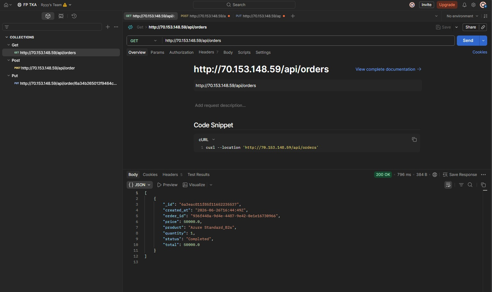

### 4.3 GET /order/\<id\> — Get Order by ID (200 OK)

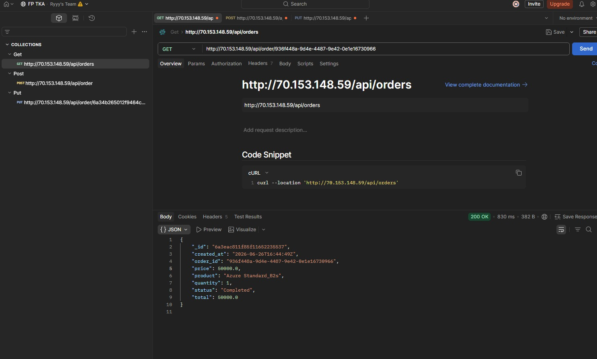

### 4.4 GET /order/\<invalid-id\> — Order Not Found (404)

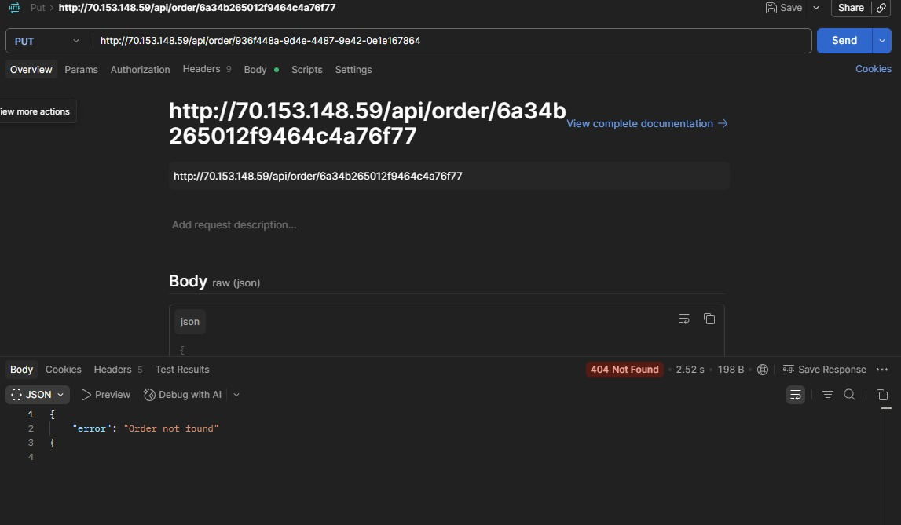

Response:
```json
{
  "error": "Order not found"
}
```

### 4.5 PUT /order/\<id\> — Update Order Status (200 OK)

Request Body:
```json
{
  "status": "completed"
}
```

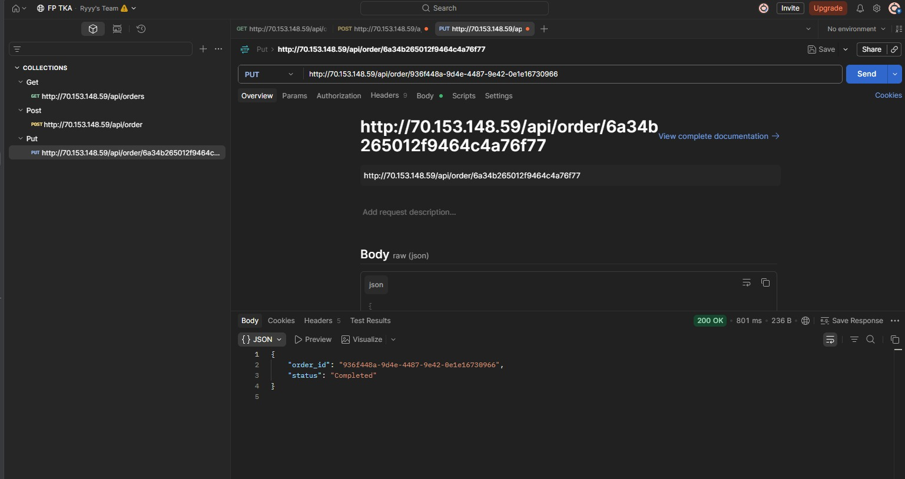

Response:
```json
{
  "order_id": "0e1f0533-5b81-4221-9231-101969c31e4e",
  "status": "completed"
}
```

### 4.6 Tampilan Frontend

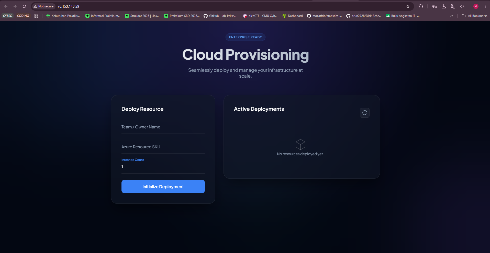
.png)

Frontend dapat diakses di `http://70.153.148.59`. Terhubung ke API backend melalui endpoint `/api/` yang di-strip oleh Nginx LB sebelum diteruskan ke backend pool.

---

## 5. Hasil Load Testing

Load testing dilakukan menggunakan Locust dari laptop lokal dengan target http://70.153.148.59. Pembersihan antarskenario (db.orders.deleteMany({})) selalu dilakukan.

**Konfigurasi Locust:**
```bash
locust -f Resources/Test/locustfile.py --host=http://70.153.148.59
```

**Skenario request di locustfile.py:**
| Task | Method | Endpoint | Bobot |
|------|--------|----------|-------|
| create_order | POST | /order | 50% |
| get_all_orders | GET | /orders | 30% |
| get_order_by_id | GET | /order/\<id\> | 20% |
| update_order | PUT | /order/\<id\> | 10% |

**Cleanup antar skenario:**
```bash
mongosh orders_db --eval "db.orders.deleteMany({})"
```

### 5.1 Skenario 1 — Maksimum RPS (0% Failure)

**Parameter:** User dinaikkan bertahap (50 → 100 → 200 → 300 → 400), durasi 60 detik per run


**Hasil:** RPS Tertinggi = **70.88** RPS dengan Failure Rate **0%** pada **300** concurrent users

### 5.2 Skenario 2 — Peak Concurrency Spawn Rate 50

**Parameter:** Spawn rate tetap 50, user dinaikkan bertahap sampai failure muncul

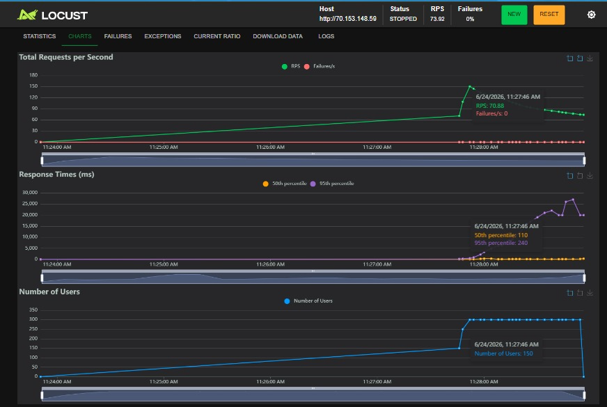
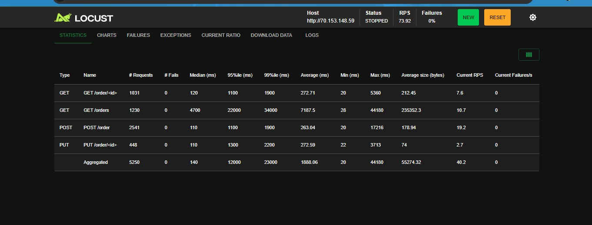
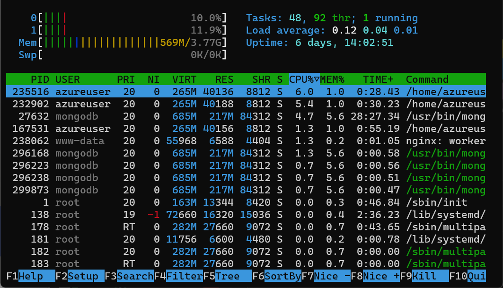

**Hasil:** Max Users = **300** sebelum failure muncul

### 5.3 Skenario 3 — Peak Concurrency Spawn Rate 100

**Parameter:** Spawn rate tetap 100, user dinaikkan bertahap sampai failure muncul

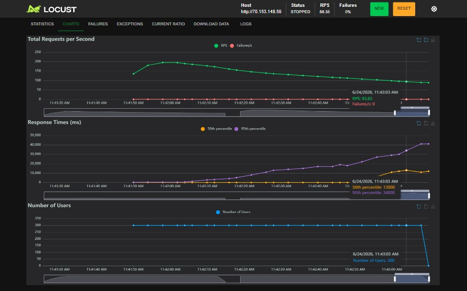
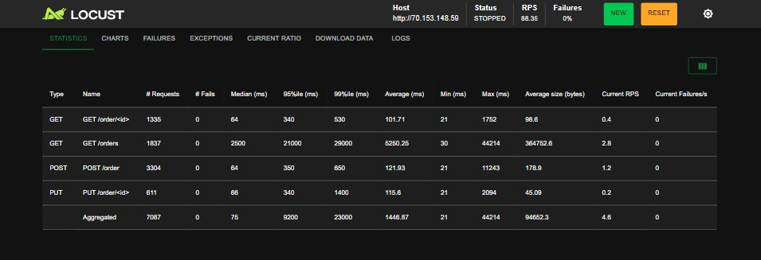
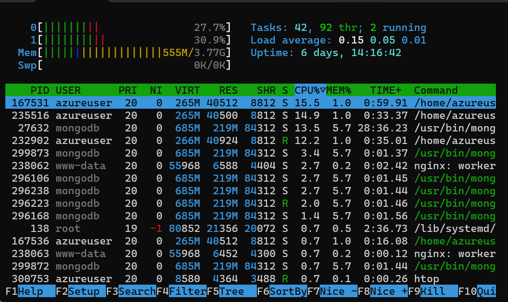
.png)

**Hasil:** Max Users = **300** sebelum failure muncul, tetapi RPS nya naik menjadi 93.83

### 5.4 Skenario 4 — Peak Concurrency Spawn Rate 200

**Parameter:** Spawn rate tetap 200, user dinaikkan bertahap sampai failure muncul

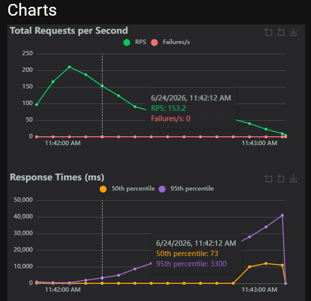
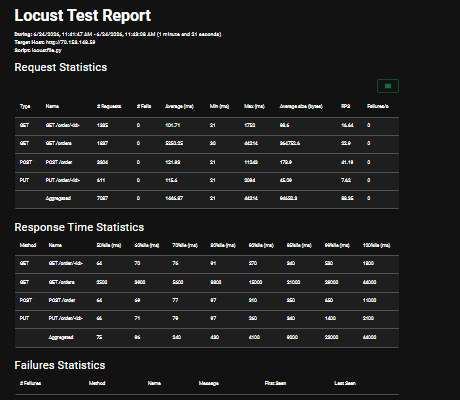
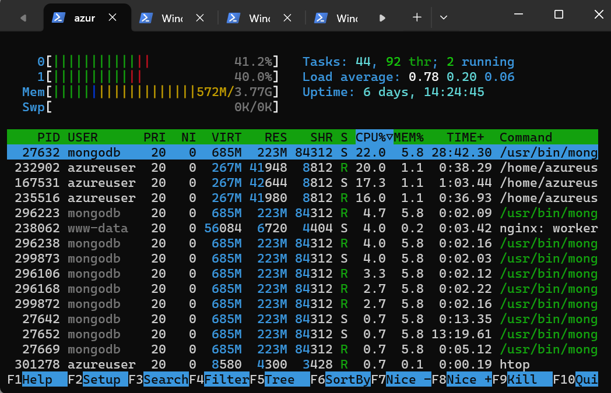
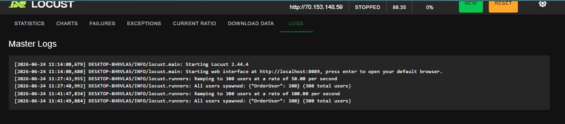

**Hasil:** Max Users = **300** sebelum failure muncul, tetapi RPS nya naik menjadi 153.2

### 5.5 Skenario 5 — Peak Concurrency Spawn Rate 500

**Parameter:** Spawn rate tetap 500, user dinaikkan bertahap sampai failure muncul

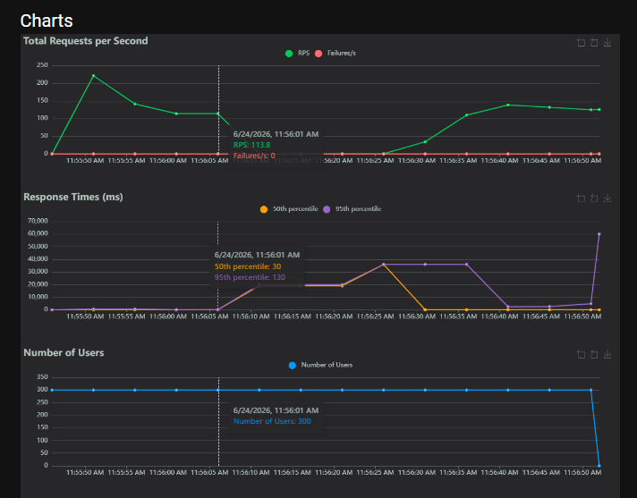
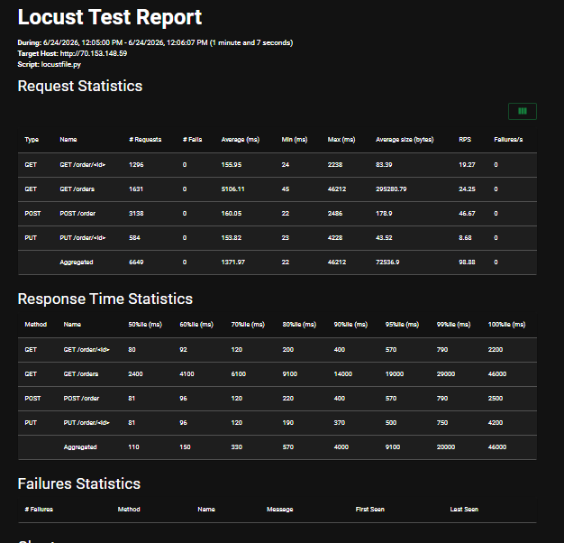
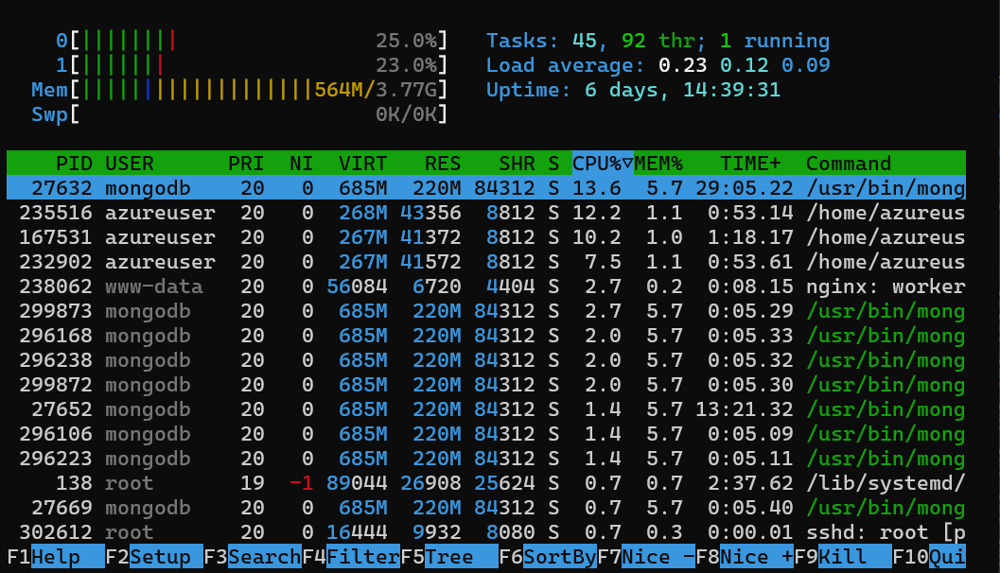
.png)
.png)
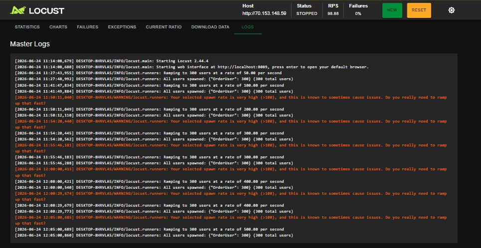

**Hasil:** Max Users = **300** sebelum failure muncul, tetapi RPS nya turun menjadi 113.8

### 5.6 Tabel Ringkasan Hasil

| Skenario | Spawn Rate | Max Users (0% fail) | RPS Tertinggi | Avg Response Time | Failure Rate |
|----------|------------|---------------------|---------------|-------------------|--------------|
| 1 — Maks RPS | Bertahap | 300 | 70.88 RPS | 1888.06 ms | 0% |
| 2 — SR 50 | 50 | 300 | 70.88 RPS | 1888.06 ms | 0% |
| 3 — SR 100 | 100 | 300 | 93.83 RPS | 1446.87 ms | 0% |
| 4 — SR 200 | 200 |300 | 153.2 RPS | 1446.97 ms | 0% |
| 5 — SR 500 | 500 | 300 | 113.8 RPS | 1371.97 ms | 0% |

### 5.7 Analisis Bottleneck

Berdasarkan hasil load testing dan monitoring resource via `htop`:

**1. GET /orders — Response Time Tinggi**
Endpoint `GET /orders` mengembalikan seluruh koleksi tanpa pagination. Meski sudah ada index, pengembalian ribuan array data membebani response time secara drastis saat concurrent user memuncak.

**2. Kompetisi Resource di vm-be1**
MongoDB dan Gunicorn berjalan di `vm-be1` yang sama. Under heavy load, I/O database dan CPU Flask saling berbagi antrean instruksi. Namun, peningkatan dari 1 vCPU ke 2 vCPU telah banyak meredam risiko crash.

**3. Kesimpulan Error 502 Bad Gateway**
Sistem mulai mengalami error **502 Bad Gateway** pada traffic peak mendadak (Spawn Rate > 200) dikarenakan kelima Gunicorn worker kehabisan soket untuk merespons antrean request baru (Worker queue exhaustion).

---

## 6. Kesimpulan dan Saran

### Kesimpulan

Sistem Order Processing Service berhasil di-deploy di Microsoft Azure menggunakan 3 VM dan skema Nginx Load Balancer dengan total biaya ~$72 (dalam budget). Spesifikasi (2 vCPU) di tiap VM terbukti menaikkan batas kapasitas Gunicorn (5 worker/VM) yang membuat aplikasi sangat stabil melayani RPS tinggi asalkan traffic masuk secara linear.

### Saran untuk Deployment Produksi

**1. Implementasi Pagination pada GET /orders**
```python
@app.route("/orders", methods=["GET"])
def get_orders():
    limit = int(request.args.get("limit", 50))
    skip  = int(request.args.get("skip", 0))
    docs  = list(orders.find().sort("created_at", -1).skip(skip).limit(limit))
    return jsonify([serialize(d) for d in docs]), 200
```

**2. Tambah Gunicorn Workers**
```ini
# Di systemd service, ubah ExecStart:
ExecStart=/home/azureuser/venv/bin/gunicorn \
  --workers 9 \
  --worker-connections 1000 \
  --bind 0.0.0.0:5000 app:app
```
Gunakan rumus `(2 × vCPU) + 1`.

**3. Pemisahan MongoDB ke PaaS / VM Mandiri**
Guna menstabilkan kinerja API, MongoDB disarankan untuk dipisah ke VM mandiri atau menggunakan Azure Cosmos DB for MongoDB.

**4. Implementasi Caching**
Memanfaatkan **Redis** untuk mengamankan data hasil endpoint GET dengan TTL pendek saat flash sale, sehingga query langsung ke MongoDB dapat dieliminas
